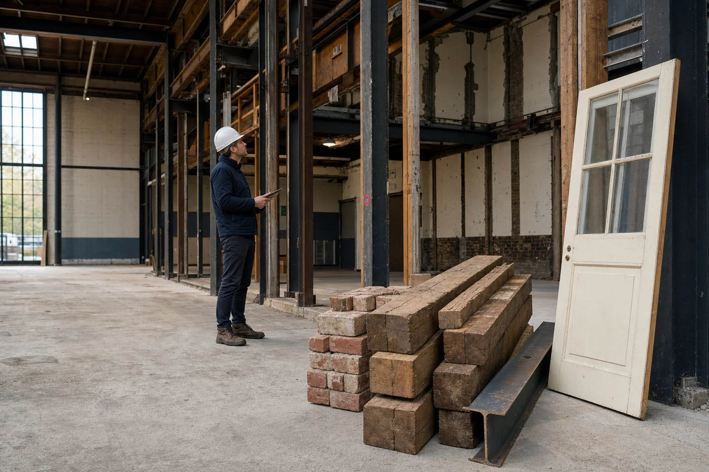
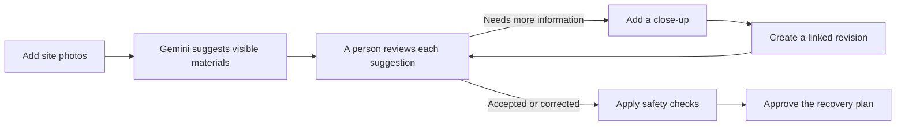

# ReBuild Loop

> **Plan what to recover before demolition starts.**

[Live application](https://rebuildloop.msnandhis.com) ·
[Sample review](https://rebuildloop.msnandhis.com/projects/demo/review) ·
[Method and limits](https://rebuildloop.msnandhis.com/method)



ReBuild Loop helps demolition and renovation teams review useful building
materials before they become mixed waste. A user uploads site photos, Gemini
suggests what may be visible, and a person decides what happens next.

The application keeps the source photo, missing information, follow-up evidence,
human decisions, safety checks, and final recovery plan together. It supports
planning; it does not certify safety, prove regulatory compliance, or guarantee
that a material will be reused or sold.

## The problem

Before removal, a door, steel member, fixture, or timber section still has a
location, visible condition, and project context. After destructive removal and
mixing, it becomes harder to identify the item or decide whether it should have
been separated for reuse, repair, specialist review, or recycling.

ReBuild Loop moves that decision earlier, while the material and its evidence
are still available.

## How it works



1. **Add site photos:** Upload up to six JPEG, PNG, or WebP images.
2. **Review Gemini's suggestions:** See the source image, visible condition,
   possible quantity, missing details, and risk flags.
3. **Make the decision:** Accept, correct, reject, request another photo, or
   send the item for specialist review.
4. **Check the route:** Fixed rules outside Gemini block direct reuse when
   structural, fire, hazard, or specialist information is unresolved.
5. **Approve the plan:** Keep a named approver, earlier revisions, evidence,
   decisions, and limitations in one printable record.

## Who does what

| Gemini                                | Application code                              | A responsible person                         |
| ------------------------------------- | --------------------------------------------- | -------------------------------------------- |
| Suggests a material and description   | Verifies file ownership and upload state      | Accepts, corrects, or rejects suggestions    |
| Describes visible condition           | Checks Gemini's response and image references | Requests another photo when evidence is weak |
| Lists missing information and risks   | Preserves revisions and decision history      | Decides when a specialist is required        |
| Rechecks an item after a new close-up | Applies fixed safety rules                    | Approves the final recovery plan             |

Gemini never approves its own suggestion.

## What works today

- Open email and password registration with Better Auth.
- User-owned renovation, demolition, and mixed projects.
- Private image upload with browser hashing and server verification.
- PostgreSQL-backed upload and analysis jobs.
- Structured Gemini image analysis linked to source evidence.
- Human accept, correct, reject, request-evidence, and specialist-review
  decisions.
- Follow-up image analysis with linked, unchanged earlier revisions.
- Material and mineral-rubble ledgers.
- Conservative recovery-route checks outside the model.
- Versioned recovery plans with named approval, print view, and audit history.
- Local Docker environment and production deployment through Coolify.

## What it does not claim

ReBuild Loop is not:

- a structural, fire, contamination, or hazardous-material certification;
- an automatic pre-demolition audit;
- a government or EPR compliance portal;
- a live buyer or recycler marketplace;
- a verified carbon, value, or waste-diversion calculator; or
- a replacement for an engineer, auditor, quantity surveyor, or contractor.

## Technology

| Area              | Technology                                      |
| ----------------- | ----------------------------------------------- |
| AI analysis       | Gemini Models through `@google/genai`           |
| Web application   | Next.js, React, TypeScript, Tailwind CSS        |
| Authentication    | Better Auth                                     |
| Data              | PostgreSQL, Drizzle ORM                         |
| Evidence storage  | Private S3-compatible object storage            |
| Background work   | TypeScript worker with durable PostgreSQL jobs  |
| Local development | Docker Compose                                  |
| Production        | Docker images deployed to a VPS through Coolify |

## Run locally with Docker

### Requirements

- Docker with Compose
- A Gemini API key

### Start the application

```bash
git clone https://github.com/msnandhis/rebuild-loop.git
cd rebuild-loop
cp .env.example .env.development.local
```

Set `GEMINI_API_KEY` and replace the development secrets inside
`.env.development.local`, then run:

```bash
docker compose \
  --env-file .env.development.local \
  -f compose.dev.yaml \
  up --build
```

Open:

- Web application: `http://localhost:3000`
- Readiness check: `http://localhost:3000/api/health/ready`
- Object-storage console: `http://localhost:9001`

Docker starts the web application, worker, PostgreSQL, and S3-compatible object
storage. Database migrations run when the web container starts.

## Repository structure

```text
apps/
  web/          Next.js interface and API routes
  worker/       Upload verification and Gemini analysis jobs
packages/
  analysis/     Gemini prompt, response contract, and validation
  db/           PostgreSQL schema and migrations
  kernel/       Shared domain types and utilities
  storage/      Private object-storage operations
  ui/           Shared interface components
docs/           Product, research, safety, demo, and engineering documentation
design-system/  ReBuild Loop's Field Ledger design system
```

## Quality checks

```bash
pnpm format:check
pnpm lint
pnpm typecheck
pnpm test
pnpm build
pnpm docker:config
```

## Documentation

Start with:

1. [Product truth, research, and hackathon story](docs/03-rebuild-loop/09-product-truth-research-and-hackathon-story.md)
2. [Product and user experience](docs/03-rebuild-loop/03-product-and-user-experience.md)
3. [Technical architecture](docs/03-rebuild-loop/04-technical-architecture.md)
4. [AI safety and evaluation](docs/03-rebuild-loop/05-ai-safety-and-evaluation.md)
5. [Demo and scoring strategy](docs/03-rebuild-loop/06-demo-and-scoring.md)
6. [Environment and branch workflow](docs/04-engineering/05-environments-and-branching.md)

## Branch and deployment workflow

- Development changes are committed and pushed to `dev`.
- `dev` reaches `main` only through a reviewed pull request.
- Production deploys from `main`.
- Secrets stay in local environment files or the production platform; they are
  never committed.

## Hackathon

ReBuild Loop was built for the **AI Agent Builder Series 2026** by AI House, in
partnership with Google for Developers, in the **Open Innovation** category.

Built by [Nandhis S](https://msnandhis.com).
