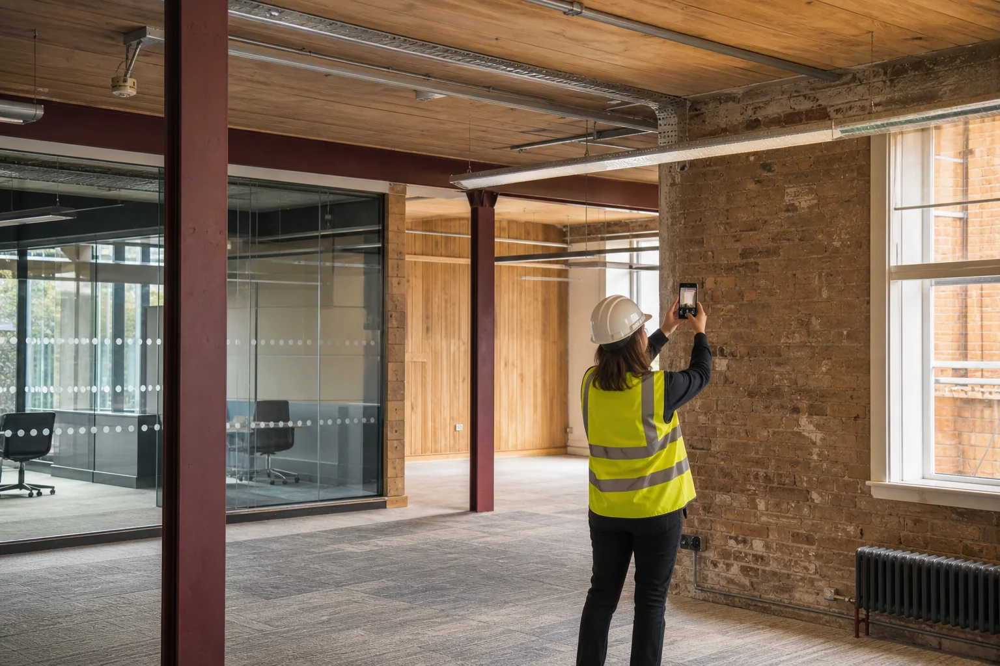
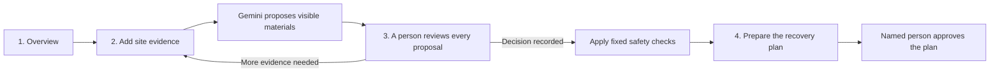
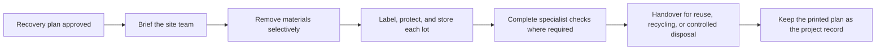
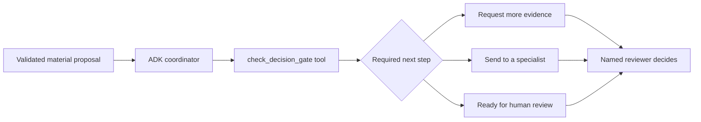

# ReBuild Loop

> **Plan what to recover before demolition starts.**

[Live application](https://rebuildloop.msnandhis.com) ·
[Sample review](https://rebuildloop.msnandhis.com/projects/demo/review) ·
[Method and limits](https://rebuildloop.msnandhis.com/method)



ReBuild Loop helps demolition and renovation teams review useful building
materials before they become mixed waste. A user uploads site photos, Gemini
suggests what may be visible, and a person decides what happens next.

The application keeps the source photos, missing information, follow-up
evidence, human decisions, safety checks, and final recovery plan together.
The result is a practical handover record that tells a site team what should be
kept separate and what must be checked before removal.

ReBuild Loop supports planning. It does not certify safety, prove regulatory
compliance, or guarantee that a material will be reused or sold.

## The product in one sentence

ReBuild Loop turns site photos into a human-reviewed list of recoverable
materials and an approved plan for handling them before demolition.

## Who it is for

- Demolition and deconstruction teams planning work on an existing building.
- Architects, contractors, and site managers deciding what should be recovered.
- Reuse organisations and material specialists who need evidence before
  accepting an item.
- Building owners who want a traceable record of recovery decisions.

## The problem

Before removal, a steel member, timber floor, window, brick wall, fixture, or
other building element still has a location, visible condition, and project
context. After destructive removal and mixing, it becomes harder to identify
the item or decide whether it should have been separated for reuse, repair,
specialist review, or recycling.

ReBuild Loop moves that decision earlier, while the material and its evidence
are still available.

## How it works



The application has four user-facing stages:

1. **Overview:** Record the project, site, work type, and basic context.
2. **Evidence:** Upload up to six JPEG, PNG, or WebP images and run an analysis.
3. **Review:** Inspect every model proposal against its source image. Accept,
   correct, reject, request more evidence, or require specialist review.
4. **Recovery plan:** See the confirmed materials, recommended actions,
   unresolved issues, and ordered removal instructions. A named person can
   approve and print the current plan.

The older ideas of a separate ledger, routes screen, and recovery pack are
combined in the recovery plan. Users do not need to repeat the same decisions
across several pages.

## What is a recovery plan?

A recovery plan brings confirmed materials, recommended actions, unresolved
issues, and removal instructions into one record. It starts as a draft. After a
named person approves it, it becomes the final instruction set that can be
shared with the site team before demolition begins.

It answers six practical questions:

1. What useful materials were found?
2. How much is likely to be available?
3. What is known about the visible condition?
4. What action is recommended for each material?
5. What must be resolved before removal or reuse?
6. Who approved the plan, and which evidence and decisions support it?

Each recovery plan contains:

| Part                | What it records                                                                                  |
| ------------------- | ------------------------------------------------------------------------------------------------ |
| Confirmed materials | Lot reference, material type, condition, quantity, and source proposal                           |
| Recommended action  | Direct reuse, same-site reuse, recycling, controlled residual handling, or specialist review     |
| Safety issues       | Missing fire, hazard, structural, or specialist information that blocks an unsafe recommendation |
| Removal sequence    | An ordered list of materials with handling instructions and key risks                            |
| Revision identity   | A version number and source hash tied to the current material decisions                          |
| Human approval      | The approver's name and approval time                                                            |
| Decision history    | Earlier evidence, corrections, review decisions, and plan revisions                              |

Gemini does not choose or approve a final action. Deterministic application
rules check the human-confirmed materials. Unknown fire, hazard, structural, or
specialist facts block direct and same-site reuse.

### Example

Suppose site photos show structural steel, hardwood flooring, and glazed
windows.

- Gemini proposes the visible materials and explains what it can and cannot see.
- A reviewer corrects the steel quantity, accepts the flooring observation, and
  requests a closer image of the window frame.
- ReBuild Loop keeps each decision linked to its evidence.
- Fixed safety rules send the structural steel for specialist review until its
  role and condition are confirmed.
- The recovery plan tells the site team to keep the steel segregated, lift the
  flooring using reversible methods, protect the recovered pieces, and verify
  the windows before choosing a destination.

The plan remains preliminary until a named person approves it.

## What happens after the recovery plan?

Approval is the end of the current ReBuild Loop workflow and the beginning of
physical site work.



After approval:

1. The site manager shares the plan with the contractor and specialists.
2. The team uses the removal order and handling notes during deconstruction.
3. Recovered lots are labelled, kept separate, and protected from damage or
   contamination.
4. Engineers, hazardous-material specialists, fire specialists, or reuse
   organisations complete any checks required by the plan.
5. Each lot is handed over for direct reuse, same-site reuse, recycling, or
   controlled residual handling.
6. The approved print view becomes part of the project handover record.

The physical removal, transport, laboratory testing, engineering
certification, regulatory submission, buyer matching, sale, and final reuse
confirmation happen outside the current application. Future versions could add
chain-of-custody scanning, contractor task completion, recipient handover, and
verified outcome reporting.

## Evidence, storage, and traceability

- Uploaded images are stored in private S3-compatible object storage, not in
  the public web directory or directly inside PostgreSQL.
- PostgreSQL stores project ownership, upload state, analysis records, model
  proposals, human decisions, confirmed material revisions, recommended
  actions, recovery plans, and audit events.
- Evidence links use short-lived signed URLs when an authorised user needs to
  view a private image.
- Corrections create new revisions instead of silently replacing earlier
  records.
- Recovery plans use a source hash so an old plan cannot remain current after
  its supporting material decisions change.
- Every consequential model proposal requires a human decision.

## Who does what

| Gemini                                | Application code                              | A responsible person                         |
| ------------------------------------- | --------------------------------------------- | -------------------------------------------- |
| Suggests a material and description   | Verifies file ownership and upload state      | Accepts, corrects, or rejects suggestions    |
| Describes visible condition           | Checks Gemini's response and image references | Requests another photo when evidence is weak |
| Lists missing information and risks   | Preserves revisions and decision history      | Decides when a specialist is required        |
| Rechecks an item after a new close-up | Applies fixed safety rules                    | Approves the final recovery plan             |

Gemini never approves its own suggestion.

## Where ADK fits

ReBuild Loop includes a standalone coordinator built with the
[Google Agent Development Kit for TypeScript](https://adk.dev/get-started/typescript/).
It demonstrates how an agent can explain a validated material proposal, call a
deterministic safety tool, and recommend the next review step.



The ADK coordinator is intentionally isolated from project data. It has no
database, object-storage, authentication, or write access and cannot approve a
material or change a project. The production image-analysis path continues to
use the durable worker and `@google/genai`. This keeps the current application
stable while making the agent's reasoning and tool boundary easy to inspect.

The implementation uses ADK's current TypeScript `LlmAgent` and `FunctionTool`
APIs. See [`apps/adk`](apps/adk) for the agent, decision gate, and tests.

## What works today

- Open email and password registration with Better Auth.
- User-owned renovation, demolition, and mixed projects.
- Private image upload with browser hashing and server verification.
- PostgreSQL-backed upload and analysis jobs.
- Structured Gemini image analysis linked to source evidence.
- Standalone ADK coordinator with a deterministic decision-gate tool.
- Human accept, correct, reject, request-evidence, and specialist-review
  decisions.
- Follow-up image analysis with linked, unchanged earlier revisions.
- A combined recovery plan with confirmed materials and recommended actions.
- Conservative safety checks outside the model.
- Versioned recovery plans with named approval, print view, and audit history.
- Local Docker environment and production deployment through Coolify.

## What it does not claim

ReBuild Loop is not:

- a structural, fire, contamination, or hazardous-material certification;
- an automatic pre-demolition audit;
- a government or EPR compliance portal;
- a live buyer or recycler marketplace;
- a verified carbon, value, or waste-diversion calculator; or
- a replacement for an engineer, auditor, quantity surveyor, or contractor.

## Technology

| Area              | Technology                                      |
| ----------------- | ----------------------------------------------- |
| AI analysis       | Gemini Models through `@google/genai`           |
| Agent workflow    | Google ADK for TypeScript, isolated coordinator |
| Web application   | Next.js, React, TypeScript, Tailwind CSS        |
| Authentication    | Better Auth                                     |
| Data              | PostgreSQL, Drizzle ORM                         |
| Evidence storage  | Private S3-compatible object storage            |
| Background work   | TypeScript worker with durable PostgreSQL jobs  |
| Local development | Docker Compose                                  |
| Production        | Docker images deployed to a VPS through Coolify |

## Run locally with Docker

### Requirements

- Docker with Compose
- A Gemini API key

### Start the application

```bash
git clone https://github.com/msnandhis/rebuild-loop.git
cd rebuild-loop
cp .env.example .env.development.local
```

Set `GEMINI_API_KEY` and replace the development secrets inside
`.env.development.local`, then run:

```bash
docker compose \
  --env-file .env.development.local \
  -f compose.dev.yaml \
  up --build
```

Open:

- Web application: `http://localhost:3000`
- Readiness check: `http://localhost:3000/api/health/ready`
- Object-storage console: `http://localhost:9001`

Docker starts the web application, worker, PostgreSQL, and S3-compatible object
storage. Database migrations run when the web container starts.

### Run the ADK coordinator

The agent runs separately from the web application. From the repository root,
set `GEMINI_API_KEY` in your shell, then choose either the terminal runner or
the local ADK development interface:

```bash
pnpm adk:run
pnpm adk:web
```

ADK Web is for local development and debugging only.

## Repository structure

```text
apps/
  adk/          Isolated Gemini agent and deterministic decision gate
  web/          Next.js interface and API routes
  worker/       Upload verification and Gemini analysis jobs
packages/
  analysis/     Gemini prompt, response contract, and validation
  db/           PostgreSQL schema and migrations
  kernel/       Shared domain types and utilities
  storage/      Private object-storage operations
  ui/           Shared interface components
docs/           Product, research, safety, demo, and engineering documentation
design-system/  ReBuild Loop's Field Ledger design system
```

## Quality checks

```bash
pnpm format:check
pnpm lint
pnpm typecheck
pnpm test
pnpm build
pnpm docker:config
```

## Documentation

Start with:

1. [Product truth, research, and hackathon story](docs/03-rebuild-loop/09-product-truth-research-and-hackathon-story.md)
2. [Product and user experience](docs/03-rebuild-loop/03-product-and-user-experience.md)
3. [Technical architecture](docs/03-rebuild-loop/04-technical-architecture.md)
4. [AI safety and evaluation](docs/03-rebuild-loop/05-ai-safety-and-evaluation.md)
5. [Demo and scoring strategy](docs/03-rebuild-loop/06-demo-and-scoring.md)
6. [Environment and branch workflow](docs/04-engineering/05-environments-and-branching.md)

## Branch and deployment workflow

- Development changes are committed and pushed to `dev`.
- `dev` reaches `main` only through a reviewed pull request.
- Production deploys from `main`.
- Secrets stay in local environment files or the production platform; they are
  never committed.

## Hackathon

ReBuild Loop was built for the **AI Agent Builder Series 2026** by AI House, in
partnership with Google for Developers, in the **Open Innovation** category.

Built by [Nandhis S](https://msnandhis.com).
