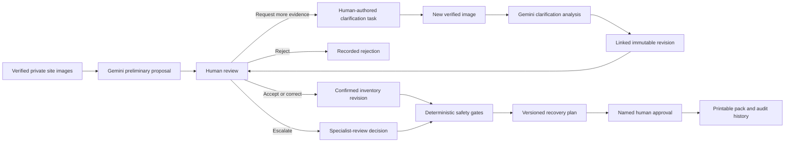

# ReBuild Loop — Product Truth, Research, and Hackathon Story

**Status:** current narrative source of truth

**Reviewed:** 30 July 2026

**Audience:** product team, demo reviewers, hackathon judges, and contributors

This document reconciles the implemented product, domain evidence, and the
currently published AI Agent Builder Series rules. It supersedes broader claims
in earlier planning documents where those claims conflict with the working
application.

## 1. Executive answer

### What is ReBuild Loop?

> **ReBuild Loop helps a demolition or renovation team decide what may be
> recovered before useful materials become mixed debris.**

It is a human-in-the-loop pre-demolition decision-support application. A user
uploads verified site images; Gemini produces preliminary material observations
linked to those images; a person accepts, corrects, rejects, requests more
evidence, or escalates each observation; and deterministic safety rules turn
confirmed items into a versioned recovery plan with named approval and an audit
history.

### The problem in plain language

Before a strip-out or demolition, doors, fixtures, steel, timber, glass, brick,
and other materials still have identity and context. After destructive removal
and mixing, it becomes harder to establish what an item was, what condition it
was in, or whether it should have been separated for reuse or recycling.

The product intervenes at that earlier decision point. It does not decide that a
component is structurally, fire, or environmentally safe. It helps a responsible
person gather evidence, record uncertainty, and make a traceable recovery
decision before work begins.

### What it is not

ReBuild Loop is not:

- a structural, fire, contamination, or hazardous-material certification;
- an automated pre-demolition audit;
- the official CPCB C&D waste portal or an EPR certificate service;
- a live buyer/recycler marketplace;
- a carbon-credit or verified diversion platform; or
- a replacement for an engineer, auditor, quantity surveyor, or contractor.

## 2. The story we should tell

### The central idea

> **Decide what survives before the excavator arrives.**

This line describes the timing advantage without promising a sale, diversion
outcome, or safety conclusion.

### Demonstration story

The following is a fictional but realistic scenario for communicating the
workflow. It must be labelled **demonstration scenario**, not a customer case
study.

**Asha is the site sustainability lead for an office renovation.** The existing
records are incomplete, and the strip-out team needs a recovery plan. Asha
photographs the doors, fixtures, and exposed metal before removal.

ReBuild Loop verifies and privately stores the images. Gemini proposes a timber
door candidate, links it to the source image, and records that its fire rating
and lower-edge condition are unknown. The proposal is not an approval.

Asha turns that unknown into a request for a close-up of the label and lower
edge. The new image starts a clarification analysis. Gemini creates a new
revision instead of replacing the earlier proposal. The close-up shows swelling,
while the fire label remains unreadable.

Asha sends the item to specialist review. Deterministic rules block direct reuse
while the fire and specialist gates are unresolved. The system records the
decision, adds the item to the recovery ledger, and includes it in a versioned
plan. Asha approves the pack; the earlier model proposal, later revision, rule
result, and human decision remain traceable.

This story demonstrates the actual product. It does not require a fake buyer,
an invented carbon figure, or a claim of regulatory compliance.

### Forty-five-second pitch

> Before a strip-out, recoverable building components are often documented too
> late. ReBuild Loop turns site images into preliminary material observations
> linked to the exact evidence. It shows what Gemini can see and what remains
> unknown. A reviewer can request a close-up, and the system creates a new
> revision without hiding the earlier result. Humans approve every material
> fact, while deterministic rules block direct reuse when fire, hazard,
> structural, or specialist evidence is unresolved. The result is a traceable
> recovery plan—not a certification and not a marketplace.

## 3. The product workflow

### Why this is agentic

ReBuild Loop is more than a chat response or a single image classifier because
it:

- maintains durable state across asynchronous upload and analysis jobs;
- uses tools for private evidence storage, database state, Gemini analysis, and
  deterministic routing;
- links proposals to the evidence used to create them;
- exposes unknowns rather than treating model output as a final answer;
- accepts task-specific new evidence and revises an existing candidate thread;
- preserves earlier revisions and human decisions; and
- hands consequential routing and approval to rules and people outside the
  model.

The accurate description is **human-supervised decision agent**. The current
application does not autonomously formulate the clarification question: Gemini
identifies unknowns, but the reviewer writes the evidence request. Public copy
must not say “the agent asks for the next best evidence” unless that capability
is implemented.

## 4. Responsibility boundaries

| Gemini does                                | Application code does                          | A responsible person does                       |
| ------------------------------------------ | ---------------------------------------------- | ----------------------------------------------- |
| Proposes a material family and description | Verifies files and ownership                   | Confirms, corrects, or rejects material facts   |
| Describes visible condition                | Validates model output and evidence references | Writes or approves a clarification request      |
| Estimates a quantity range                 | Preserves immutable revisions and audit events | Decides whether specialist review is needed     |
| Identifies unknowns and risk flags         | Applies versioned safety gates                 | Supplies measurements and professional evidence |
| Re-analyses a submitted close-up           | Blocks unsafe direct-reuse routes              | Approves the recovery plan                      |

Confidence values are model signals, not calibrated probabilities. A model
proposal cannot certify quantity, fitness, hazard status, legal compliance, or a
recovery outcome.

## 5. What is implemented today

The following is supported by the application and repository as of the review
date:

1. Open email/password registration and sign-in using Better Auth.
2. User-owned renovation, demolition, and mixed projects.
3. Capture or selection of up to six JPEG, PNG, or WebP images.
4. Browser hashing, signed upload, server verification, and private
   S3-compatible object storage.
5. Durable PostgreSQL-backed upload and analysis jobs.
6. Real Gemini structured multimodal analysis with evidence references,
   unknowns, risk flags, and semantic validation.
7. Human accept, correct, reject, request-evidence, and specialist-review
   decisions.
8. Clarification-image submission and a real linked Gemini re-analysis.
9. Immutable candidate and inventory revisions with audit history.
10. Recovery and mineral-rubble ledger views.
11. Conservative deterministic route gates.
12. Drafting, approving, and printing a versioned recovery plan.

Representative implementation evidence:

- upload interface: `apps/web/src/components/capture/capture-manifest.tsx`
- file verification: `apps/worker/src/tasks/verify-upload.ts`
- Gemini contract and prompt: `packages/analysis/src/contract.ts` and
  `packages/analysis/src/prompt.ts`
- analysis persistence: `apps/worker/src/tasks/analyze-project.ts`
- human decisions: `apps/web/src/lib/review-decisions.ts`
- clarification workflow: `apps/web/src/lib/clarifications.ts`
- route rules: `apps/web/src/lib/recovery-rules.ts`
- plans and approval: `apps/web/src/lib/recovery.ts`

### Demonstration or synthetic content

- `/projects/demo/review` is a hard-coded, read-only UI demonstration; its
  decisions are not saved.
- Landing-page register entries are presentation examples, not measured
  project results.
- The repository has 12 evaluation scenario definitions, but no attached image
  fixture set or measured Gemini accuracy result.

### Not implemented

- video, speech, PDF, spreadsheet, or BOQ intake;
- buyer/recycler demand data or matching;
- live marketplace transactions;
- impact-factor, carbon, value, or verified-diversion calculations;
- CPCB, local-authority, EPR, BIM, GIS, or municipal integrations;
- generated PDF passports or formal audit certificates;
- professional specialist assignment and closure; and
- a browser-level end-to-end test suite.

These are roadmap ideas, not current submission claims.

## 6. Who it is for

### Primary persona

For the hackathon, choose one primary user:

> **A pre-demolition reviewer or site sustainability lead responsible for
> documenting recoverable materials before a commercial renovation or
> strip-out.**

This is narrower and more believable than addressing developers, contractors,
auditors, ESG teams, buyers, recyclers, and municipalities equally.

### Job to be done

> When a renovation or demolition is being planned, help me turn incomplete site
> images into a reviewed material ledger and recovery plan, so the team can
> separate candidates and unresolved risks before destructive work begins.

### Current validation status

The persona, workflow, willingness to pay, and time saving are product
hypotheses. The repository does not contain completed customer interviews,
pilots, paid use, or verified recovery outcomes. “Designed for Indian project
workflows” is supportable; “validated in India” is not yet supportable.

## 7. Research and data points

Use research to establish context, not to substitute for product validation.
Every number needs its geography, year, and limitation.

| Claim                                                                                                                                                                                                                        | Primary evidence                                                                    | Correct use                                                                       | Important caveat                                                                                       |
| ---------------------------------------------------------------------------------------------------------------------------------------------------------------------------------------------------------------------------- | ----------------------------------------------------------------------------------- | --------------------------------------------------------------------------------- | ------------------------------------------------------------------------------------------------------ |
| Buildings and construction account for about **37% of global CO₂ emissions** and nearly **50% of global material extraction**.                                                                                               | UNEP/GlobalABC, _Global Status Report for Buildings and Construction 2025–2026_ [1] | Establishes the global importance of material and building decisions.             | Sector-wide global context; it does not measure ReBuild Loop's impact.                                 |
| MoHUA reported that Indian cities generated about **30,000 tonnes of debris per day** and about 15,000 tonnes/day was handled at 400 C&D plants in 2023.                                                                     | Ministry of Housing and Urban Affairs, 27 September 2023 [2]                        | A government-reported urban snapshot that makes the problem scale understandable. | It is not a measured 2026 national total and “handled” must not be rewritten as recovered or recycled. |
| CPCB reported **36 operational C&D processing facilities with about 13,560 tonnes/day capacity** and 29 proposed facilities with about 4,050 tonnes/day capacity in its 2022–23 report.                                      | CPCB Annual Report 2022–23 [3]                                                      | A dated infrastructure snapshot.                                                  | It is not the current 2026 facility count or proof of actual throughput.                               |
| India's 2025 C&D rules took effect on **1 April 2026** and apply broadly to construction, demolition, remodelling, renovation, and repair.                                                                                   | Gazette of India, G.S.R. 317(E), 2 April 2025 [4]                                   | Establishes current national policy relevance.                                    | Application is broad, but producer/EPR obligations have defined thresholds and procedures.             |
| Under those rules, a “producer” is the person in charge of a project with **20,000 m² or more built-up area**.                                                                                                               | Rule 3(1)(q) [4]                                                                    | Defines the threshold accurately.                                                 | Do not imply every small renovation has producer EPR obligations.                                      |
| The rules exclude usable or resalable iron, wood, plastic, metal, and glass from the debris used to assess EPR targets, while listing concrete, brick, plaster, stone, rubble, tiles, and ceramics in the debris accounting. | Rules 5(4)–5(5) [4]                                                                 | Supports a separate recovery-component lane and mineral-debris planning lane.     | ReBuild Loop's lane is preliminary decision support, not a legal determination.                        |
| EU guidance treats pre-demolition/pre-renovation audits and selective demolition as tools for reuse, safe hazardous-material handling, and higher-quality recycling.                                                         | European Commission, 2024 protocol and CDW guidance [5][6]                          | Supports the timing and evidence logic of the workflow.                           | EU guidance is not Indian law and must not be presented as such.                                       |

### The strongest research conclusion

The defensible story is not “India produces exactly X million tonnes of
demolition waste.” Official Indian statements themselves use widely varying
estimates: a February 2024 MoHUA release cited a broad range of 150–500 million
tonnes per year.[11] The stronger conclusion is:

> C&D waste is material at global and Indian scale, current Indian rules require
> segregation and introduce explicit waste-management and EPR mechanisms, and
> pre-demolition evidence is a recognised method for improving reuse and
> recycling decisions.

### Regulatory interpretation for the product

The 2025 rules justify the relevance of good source evidence and separate
material streams. They do **not** make ReBuild Loop a compliance system.

Safe product wording:

> ReBuild Loop can prepare preliminary evidence and material summaries that may
> support project planning. A responsible professional and the applicable
> authorities determine regulatory classification and compliance.

A route recommendation is a next action, not proof that a material is fit for
use. For example, BIS recognises that aggregates covered by IS 383:2016 may
include aggregates from construction and demolition waste, while CPWD guidance
still requires quality control, relevant standards, specifications, and
feasibility.[12][13] ReBuild Loop's current five-gate rule set does not perform
those tests.

## 8. Competitive position

AI-assisted material audits, passports, exchanges, and marketplaces already
exist internationally. ReBuild Loop should not claim to be the first.

Its current, credible wedge is:

- phone-image-first work on low-data existing sites;
- explicit separation between evidence, model proposal, and human decision;
- a linked clarification and revision history;
- conservative deterministic gates outside Gemini;
- preliminary separation of recoverable components from mineral rubble; and
- compatibility with existing professional, scrap, recycler, and municipal
  channels rather than dependence on a new marketplace.

The product should compete on the quality of the **first-mile evidence and
decision record**, not on an unimplemented network of destinations.

## 9. Current hackathon requirements

The following reflects the live organiser pages and submission configuration on
30 July 2026.

| Published item      | Current information                                                                 | ReBuild Loop response                                                               |
| ------------------- | ----------------------------------------------------------------------------------- | ----------------------------------------------------------------------------------- |
| Programme           | AI Agent Builder Series 2026 by AI House, in partnership with Google for Developers | Use the organiser's wording; do not imply a separate Google-run competition.        |
| Submission deadline | **1 August 2026, 11:59 PM IST**                                                     | Treat this as the deadline. Earlier repository references to 5 August are stale.    |
| Voting close        | **1 August 2026, 11:59 PM IST**                                                     | Community outreach must finish before the same cutoff.                              |
| Submission assets   | Working AI agent, demo video, GitHub repository, problem statement, and pitch       | Keep the public demo and repository reviewer-ready.                                 |
| Score               | Analysis 50%, community votes 25%, structured feedback 25%                          | Build, communication, and visible iteration all matter.                             |
| Qualification       | Top 100 qualify for the in-person finale                                            | Do not call the current build a finalist unless selected.                           |
| Finale              | **8 August 2026, 9:00 AM IST**, Bengaluru                                           | The exact venue is currently undisclosed; earlier “Google Office” wording is stale. |
| Category            | Open innovation is active                                                           | Submit as Open Innovation, not municipal waste collection.                          |
| Technology          | Gemini Models is an active technology option                                        | Select Gemini Models; name the rest of the stack accurately.                        |

Primary programme sources are the [AI House programme page][7], the live
[submission configuration][8], and the [finale listing][9].

### Live submission-form checklist

The current [submission form][10] requires:

- full name and LinkedIn profile;
- agent name;
- product description;
- differentiation;
- major roadblocks;
- a thumbnail smaller than 5 MB;
- at least one technology selection;
- a submission category;
- a working live-demo URL; and
- a video-demo URL.

GitHub profile and repository fields are currently optional in the form, even
though the organiser page describes a GitHub repository as an expected
submission asset. Provide the repository. The form's “problem statement” control
is the category selector, so the description and differentiation fields must
carry the actual user, problem, workflow, and value story.

No detailed technical sub-rubric is published. Innovation, problem clarity,
responsible AI, usability, reliability, and feasibility are sensible judging
lenses, but they must be labelled **inferred**, not official weighted criteria.
The public material also does not resolve team size, IP ownership, travel
support, open-source requirements, tie-breaking, or the exact structured
feedback formula.

## 10. Judging strategy

### Analysis — 50%

Show one real, stateful loop:

> verified evidence → Gemini proposal → human clarification request → new
> evidence → linked Gemini revision → human decision → deterministic safety gate
> → approved pack

Make the tool boundaries visible. Do not spend the demo on auth, every
navigation tab, or a speculative marketplace.

### Community votes — 25%

Use one understandable contrast: an intact component before removal and mixed
debris after removal. A 30–45 second clip should show a proposal changing after
new evidence. Avoid dense regulatory copy and unsupported environmental
figures.

### Structured feedback — 25%

Maintain a dated log:

| Date | Feedback source | What changed | Evidence |
| ---- | --------------- | ------------ | -------- |
| —    | —               | —            | —        |

Do not say the product improved from organiser feedback until the feedback and
resulting change are recorded.

## 11. Three-minute demo

|      Time | What to show                                            | What to say                                                             |
| --------: | ------------------------------------------------------- | ----------------------------------------------------------------------- |
| 0:00–0:18 | Intact component, then mixed debris                     | “Recovery decisions are easier while the material still has identity.”  |
| 0:18–0:35 | Clearly labelled demonstration project                  | Name the single user and job.                                           |
| 0:35–0:58 | Upload verified site images and show the analysis run   | Gemini proposes observations; it does not approve them.                 |
| 0:58–1:22 | Evidence-linked door proposal and unknowns              | Point to the source image, condition, and unresolved fire label.        |
| 1:22–1:43 | Reviewer writes the targeted request; submit a close-up | Describe this honestly as human-authored in the current build.          |
| 1:43–2:05 | Revision 1 versus revision 2                            | The new evidence changes the record without erasing the first proposal. |
| 2:05–2:28 | Specialist decision and failed route gates              | Deterministic rules block direct reuse outside Gemini.                  |
| 2:28–2:48 | Ledger, plan, named approval, and audit trail           | Every consequential step has an accountable actor.                      |
| 2:48–3:00 | Architecture boundary and closing line                  | “Decide what survives before the excavator arrives.”                    |

Keep one pre-analysed fallback project for the live pitch, but also demonstrate
that the real Gemini path works.

## 12. Claims policy

### Safe claims

- preliminary material observation;
- evidence-linked Gemini proposal;
- model-identified unknown;
- human-confirmed or human-corrected item;
- deterministic recovery route;
- specialist-review block;
- preliminary planning lane;
- versioned, printable recovery plan; and
- private evidence with an audit history.

### Claims to avoid

- “verified material” when only a user confirmed a proposal;
- “the agent autonomously asks for evidence” in the current build;
- “phone walkthrough” when intake is still images;
- “optional BOQ” or “document extraction”;
- “matched reuse opportunities” or “buyer-ready lots”;
- exact carbon saved, value recovered, or waste diverted;
- automated or guaranteed compliance;
- CPCB-approved, government-certified, or EPR-certified;
- certified safe for structural or fire-rated reuse;
- “India's first” or “world's first”; and
- “validated for India” without field research.

## 13. Submission-ready copy

### Agent name

**ReBuild Loop — Pre-Demolition Recovery Agent**

### One-line description

> ReBuild Loop turns site images into a human-reviewed material ledger and
> recovery plan before demolition turns useful components into mixed debris.

### Problem and solution

> Recoverable building components are often documented too late, after
> destructive removal has reduced the available evidence and recovery options.
> ReBuild Loop gives a pre-demolition reviewer a structured workflow for acting
> earlier. Gemini turns verified site images into preliminary observations tied
> to the source evidence and exposes what remains unknown. A person accepts,
> corrects, rejects, requests a close-up, or escalates each proposal. New
> evidence creates a linked revision rather than hiding the earlier result.
> Deterministic rules then block unsafe direct-reuse routes and produce a
> versioned plan with named approval and an audit trail. The product is decision
> support, not a certification, compliance portal, or marketplace.

### Differentiation

> ReBuild Loop focuses on the first-mile decision before demolition: incomplete
> site evidence, unresolved risks, and accountable material decisions. Its
> distinction is not image recognition alone. It preserves the evidence behind
> every proposal, supports a clarification and revision loop, keeps safety rules
> outside the model, and requires a named human decision before a recovery plan
> is approved.

### Major roadblock

> Site images cannot prove exact quantity, structural fitness, fire performance,
> or the absence of hazardous material. The application therefore presents
> preliminary ranges and unknowns, preserves source evidence, requires human
> decisions, and blocks direct reuse when a specialist or safety gate remains
> unresolved. The current prototype also has no live buyer or government
> integration, so it makes no transaction or compliance claim.

### Category and stack

- **Category:** Open Innovation
- **Google technology:** Gemini Models
- **Application stack:** Next.js, TypeScript, PostgreSQL, Better Auth, Docker,
  Coolify, and S3-compatible private object storage

## 14. Evidence and evaluation plan

The codebase currently has passing unit tests and 12 scenario definitions. This
is not a measured model evaluation and must not be presented as one.

Before claiming model quality:

1. Attach consented or purpose-created images to a small labelled set.
2. Record the expected material family, evidence reference, unknowns, risk
   posture, and required human action.
3. Run the actual production-shaped Gemini workflow.
4. Report sample count, schema-validity rate, material-family result,
   evidence-reference correctness, specialist-block recall, and clarification
   usefulness.
5. Publish failures and limitations, not only successful examples.

The safety goal is not a decorative “95% accuracy” figure. It is to demonstrate
that unresolved structural, fire, hazard, and specialist cases do not reach a
direct-reuse recommendation.

## 15. Priority corrections before submission

### P0 — credibility and judging

1. Reconcile public copy with the image-only, no-matching implementation.
2. Either have Gemini propose a structured clarification that a human
   approves/edits, or keep the current human-authored wording throughout.
3. Run an authenticated production smoke test across upload, analysis, review,
   clarification, route, plan, approval, print, and audit.
4. Add browser-level end-to-end coverage for the flagship workflow.
5. Create and score a real image-based evaluation set.
6. Verify deadline, venue, and submission form again immediately before
   submission.

### P1 — evidence of product need

1. Interview at least three people who conduct renovation, quantity-surveying,
   circularity, or demolition-planning work.
2. Record what they do today, where evidence is lost, who approves decisions,
   and what would make the recovery pack useful.
3. Add a dated feedback-to-change log.
4. Prepare both a live demo and a recorded fallback.

### P2 — after the signature loop is proven

- BOQ and video intake;
- agent-proposed clarification;
- destination directories and transparent matching;
- professional specialist closure;
- formal export formats and portal integrations; and
- measured planned-versus-verified outcomes.

## 16. Final narrative rule

Tell one true story about a decision changing when better evidence arrives.
That is more persuasive than a long feature list or a large unsupported waste
statistic.

---

## References

All external sources were reviewed on 30 July 2026.

1. [UN Environment Programme and GlobalABC, _Global Status Report for Buildings and Construction 2025–2026_](https://www.unep.org/resources/report/global-status-report-buildings-and-construction-2025-2026)
2. [Press Information Bureau, Ministry of Housing and Urban Affairs, “Delhi's Malba Project,” 27 September 2023](https://www.pib.gov.in/PressReleasePage.aspx?PRID=1961313)
3. [Central Pollution Control Board, _Annual Report 2022–23_, pp. 46–49](https://cpcb.nic.in/openpdffile.php?id=UmVwb3J0RmlsZXMvMTY2OV8xNzI3NDE0NTc1X21lZGlhcGhvdG8yOTAyNy5wZGY%3D)
4. [Gazette of India, Environment (Construction and Demolition) Waste Management Rules, 2025, G.S.R. 317(E)](https://egazette.gov.in/writeReadData/2025/262313.pdf)
5. [European Commission, _EU Construction & Demolition Waste Management Protocol_, updated edition 2024](https://op.europa.eu/en/publication-detail/-/publication/d63d5a8f-64e8-11ef-a8ba-01aa75ed71a1/language-en)
6. [European Commission, “Construction and demolition waste”](https://environment.ec.europa.eu/topics/waste-and-recycling/construction-and-demolition-waste_en)
7. [AI House, “AI Agent Builder Series 2026”](https://www.aihouze.xyz/agent-builder)
8. [HiDevs, live nomination configuration for `google_builder_series_2026`](https://dev.api.hidevs.xyz/api/nominations/config?program=google_builder_series_2026)
9. [AI House, “Real Builders, Real Pitch: AI HOUSE Hackathon”](https://luma.com/ai-zxaj)
10. [HiDevs, live AI Agent Builder Series submission form](https://app.hidevs.xyz/nominate/google)
11. [Press Information Bureau, Ministry of Housing and Urban Affairs, “National Workshop on Management of Construction and Demolition Waste,” 22 February 2024](https://www.pib.gov.in/PressReleasePage.aspx?PRID=2007086)
12. [Bureau of Indian Standards, _Indian Standards referred in government regulations_, including IS 383:2016](https://www.bis.gov.in/wp-content/uploads/2021/09/Indian-Standards-in-PWDs.pdf)
13. [Central Public Works Department, _CPWD Works Manual 2022_](https://cpwd.gov.in/Publication/CPWD_Works_Manual_2022_13122022.pdf)

[1]: https://www.unep.org/resources/report/global-status-report-buildings-and-construction-2025-2026
[2]: https://www.pib.gov.in/PressReleasePage.aspx?PRID=1961313
[3]: https://cpcb.nic.in/openpdffile.php?id=UmVwb3J0RmlsZXMvMTY2OV8xNzI3NDE0NTc1X21lZGlhcGhvdG8yOTAyNy5wZGY%3D
[4]: https://egazette.gov.in/writeReadData/2025/262313.pdf
[5]: https://op.europa.eu/en/publication-detail/-/publication/d63d5a8f-64e8-11ef-a8ba-01aa75ed71a1/language-en
[6]: https://environment.ec.europa.eu/topics/waste-and-recycling/construction-and-demolition-waste_en
[7]: https://www.aihouze.xyz/agent-builder
[8]: https://dev.api.hidevs.xyz/api/nominations/config?program=google_builder_series_2026
[9]: https://luma.com/ai-zxaj
[10]: https://app.hidevs.xyz/nominate/google
[11]: https://www.pib.gov.in/PressReleasePage.aspx?PRID=2007086
[12]: https://www.bis.gov.in/wp-content/uploads/2021/09/Indian-Standards-in-PWDs.pdf
[13]: https://cpwd.gov.in/Publication/CPWD_Works_Manual_2022_13122022.pdf
